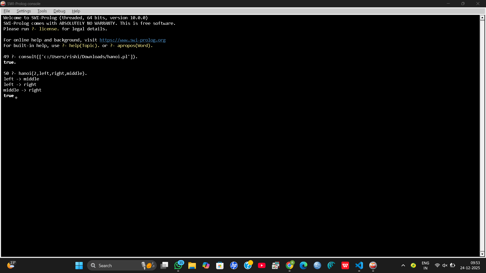
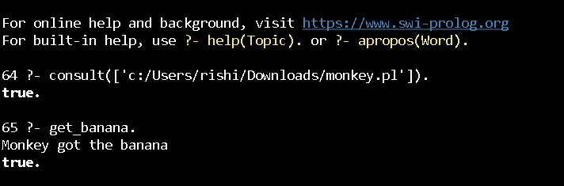
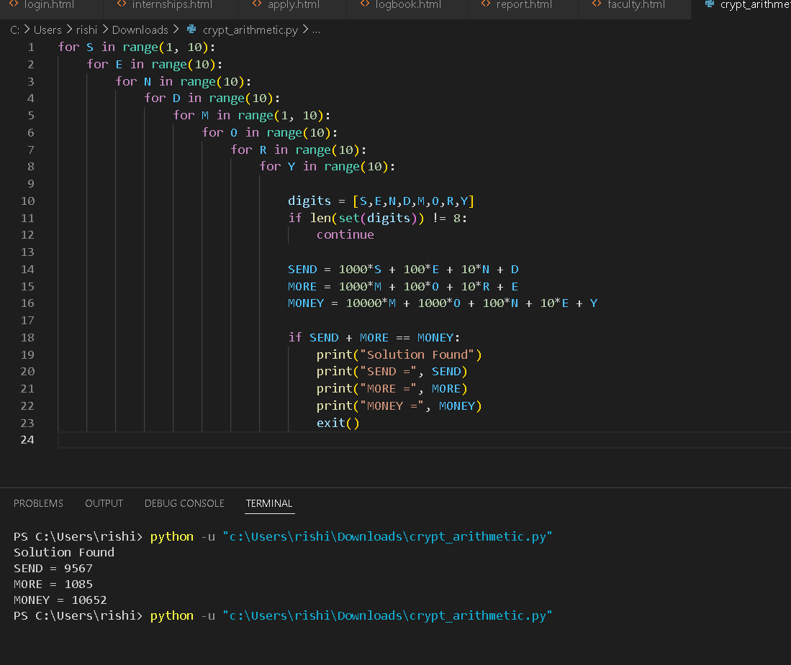
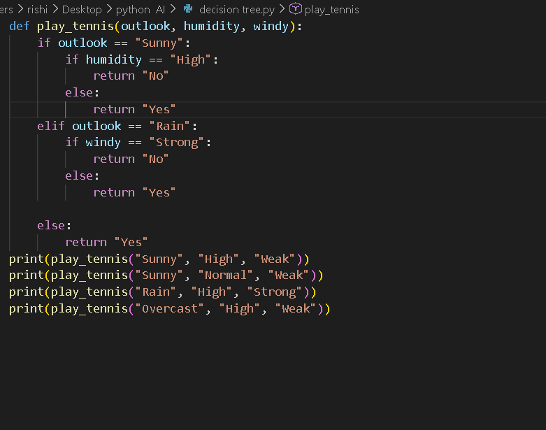
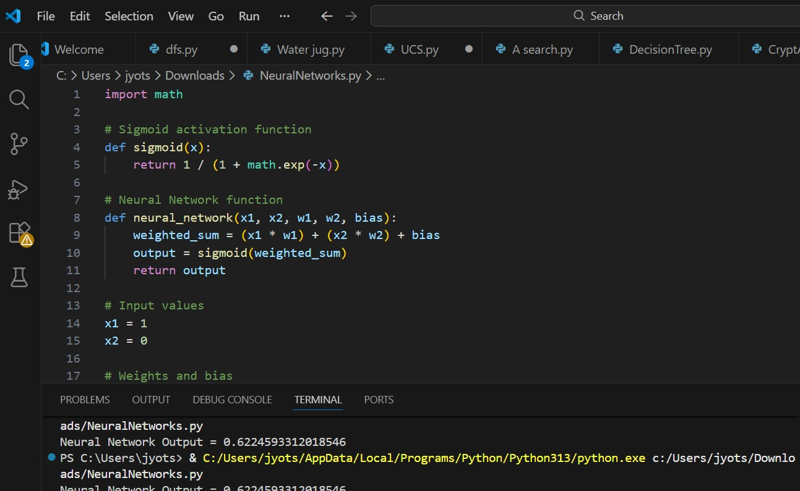

Artificial Intelligence Assignments

  

Repository Overview

This repository contains all the assignments completed as part of the Artificial Intelligence course.
It includes implementations of important AI algorithms, logic-based problems, and machine learning basics using Python and Prolog.

The repository includes:

AI algorithm implementations
Logic programming problems
Pseudocode for each algorithm
Output screenshots
Problem-solving examples
Student Details

Name: ROSHAN.K
Register Number: 192425014
Course: Artificial Intelligence

Algorithms Implemented
Search Algorithms
Breadth First Search

Files:

bfs.py
BFS.png

Pseudocode:

1. Start with the root node.
2. Insert it into a queue.
3. Mark it visited.
4. Remove node from queue.
5. Add all unvisited neighbors to queue.
6. Repeat until goal node is found.
Depth First Search

Files:

dfs.py
DFS.png

Pseudocode:

1. Start with initial node.
2. Push node onto stack.
3. Mark node visited.
4. Pop node from stack.
5. Push its unvisited neighbors.
6. Continue until goal is found.
Uniform Cost Search

Files:

ucs.py
UCS.png

Pseudocode:

1. Insert start node with cost 0.
2. Use priority queue.
3. Expand lowest cost node.
4. Update path cost.
5. Continue until goal node reached.
Greedy Best First Search

Files:

GreedybestFirstSearch.py
GeedySearch.png

Pseudocode:

1. Start from initial node.
2. Choose node with smallest heuristic value.
3. Expand node.
4. Repeat until goal node reached.
A* Search Algorithm

Files:

A search.py
ASearch.png

Pseudocode:

1. Add start node to open list.
2. Calculate f(n) = g(n) + h(n).
3. Select node with lowest f value.
4. Expand node.
5. Continue until goal is reached.
Game Playing Algorithms
Minimax Algorithm

Files:

Minimax.py
Minimax.png

Pseudocode:

1. Generate game tree.
2. Assign utility values.
3. Propagate values upward.
4. Maximizer chooses maximum value.
5. Minimizer chooses minimum value.
Alpha Beta Pruning

Files:

AlphaBetaPruning.py
AlphaBeta.png

Pseudocode:

1. Perform minimax search.
2. Maintain alpha and beta values.
3. Prune branches where alpha >= beta.
AI Problem Solving Programs
Water Jug Problem

Files:

water jug.py
Water jug output.png

Pseudocode:

1. Start with empty jugs.
2. Fill one jug.
3. Pour water between jugs.
4. Empty when needed.
5. Continue until target amount is obtained.
Tower of Hanoi

Monkey Banana Problem

Crypt Arithmetic Problem

Files:

crypt_arithmetic.py
Machine Learning Concepts
Decision Tree

Files:

decision tree.py
Neural Network

Files:

neural network.py
Prolog Programs

This repository also contains logic programming assignments implemented in Prolog.

Topics include:

Family relationship system
Bird flying rules
Pattern matching
Medical expert system
Fruit color classification
Best First Search in Prolog

Example Prolog Rule:

bird(X) :- flies(X).
Output Screenshots

The repository includes multiple output screenshots such as:

BFS traversal output
DFS traversal output
Water jug result
Neural network output
Decision tree result
Pattern recognition
AI reasoning problems
Tools and Technologies

Programming Languages

Python
Prolog

Software

VS Code
Python IDLE

Concepts

Artificial Intelligence
Search Algorithms
Game Theory
Knowledge Representation
Machine Learning Basics
Learning Outcomes

Through this project, I learned:

Implementation of classical AI algorithms
Problem solving using search techniques
Game playing strategies
Logic programming with Prolog
AI decision making models
Understanding heuristic search
Future Improvements
Add algorithm visualizations
Improve documentation
Add more advanced AI algorithms
Implement real-world AI problems
Repository Purpose

This repository acts as:

A record of my AI lab assignments
A learning resource for AI algorithms
A reference for students studying Artificial Intelligence
